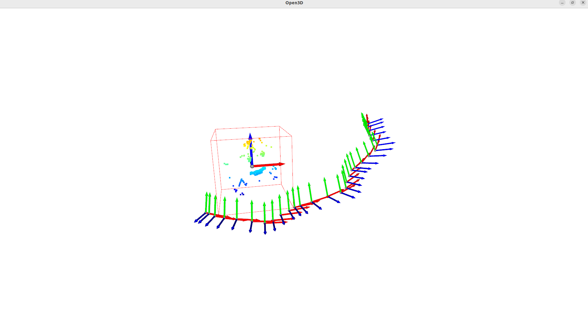

### Useage [Updating]

1.Prepare Data

```yaml
|--camera_path
|--|--0.npy  [3x4] w2c camera pose
|--|--1.npy
|--|--...
```

2.Run Script

```bash
python vis.py --mesh_path xxx --camera_path xxxx
```

#### Example


